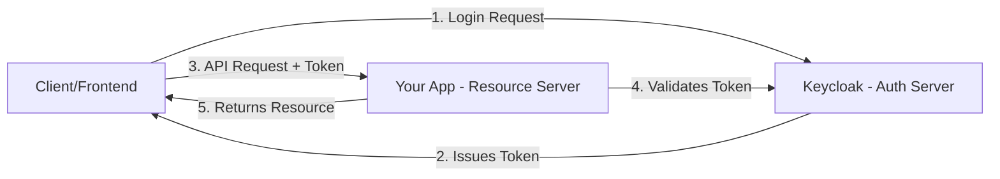
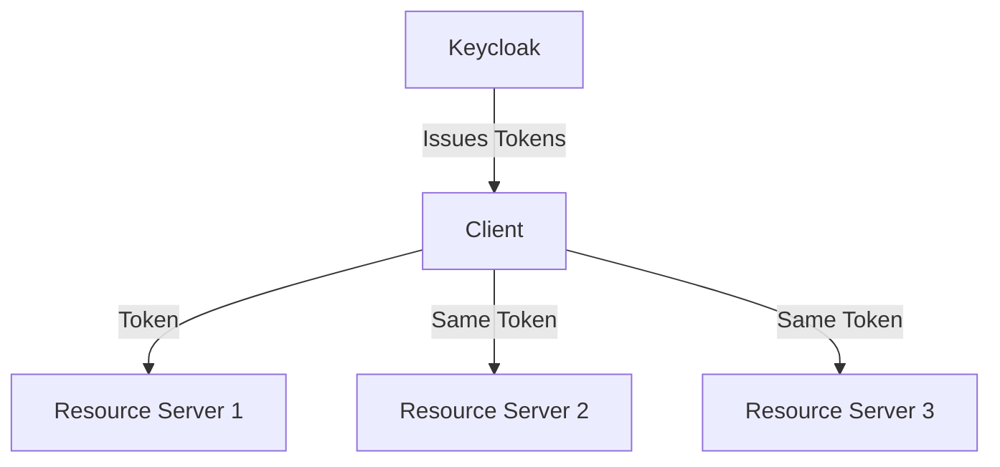

I'll explain the security configuration of your Spring Boot application that uses Keycloak as an authentication and authorization server in detail.

Let's break this down into two main parts:

### 1. SecurityConfig.java

This is your main security configuration class that sets up the security filter chain and CORS configuration.

```java:SecurityConfig.java
@Configuration
@EnableWebSecurity  // Enables Spring Security's web security support
public class SecurityConfig {
    @Bean
    public SecurityFilterChain securityFilterChain(HttpSecurity http) throws Exception {
```

The security filter chain configuration consists of several parts:

1. **CORS Configuration**:
```java
.cors(Customizer.withDefaults())
```
- Enables Cross-Origin Resource Sharing
- Uses the `corsFilter()` bean defined below to handle CORS requests
- Critical for frontend applications running on different domains

2. **CSRF Configuration**:
```java
.csrf(AbstractHttpConfigurer::disable)
```
- Disables CSRF protection
- Generally safe for REST APIs using JWT tokens
- CSRF is more relevant for traditional web applications with session cookies

3. **URL Authorization Rules**:
```java
.authorizeHttpRequests(authorizeRequests ->
    authorizeRequests.requestMatchers(
        "/v3/api-docs/",
        "/swagger-ui/**",
        // ... other paths ...
        "/ws/**"
    ).permitAll()
    .anyRequest()
    .authenticated()
)
```
- Defines which URLs are publicly accessible and which require authentication
- Permits access to Swagger documentation and WebSocket endpoints without authentication
- All other endpoints require authentication

4. **OAuth2 Resource Server Configuration**:
```java
.oauth2ResourceServer(auth -> auth.jwt(token ->
    token.jwtAuthenticationConverter(new KeyCloakJwtAuthenticationConverter())))
```
- Configures the application as an OAuth2 resource server
- Uses JWT tokens for authentication
- Implements a custom JWT converter specifically for Keycloak tokens

              Let me explain what it means to be an OAuth2 resource server and how it fits into the larger OAuth2/OpenID Connect architecture.

### OAuth2 Resource Server Explained

An OAuth2 Resource Server is a server that hosts protected resources (your API endpoints, data, services) and can accept and validate access tokens. In your case:

4.1 **Role in OAuth2 Flow**:


4.2 **Configuration in Your Application**:
```java
@Configuration
public class SecurityConfig {
    @Bean
    public SecurityFilterChain securityFilterChain(HttpSecurity http) throws Exception {
        return http
            // ... other configs ...
            .oauth2ResourceServer(auth -> auth.jwt(token ->
                token.jwtAuthenticationConverter(new KeyCloakJwtAuthenticationConverter())))
            .build();
    }
}
```

### Key Aspects of Being a Resource Server

1. **Token Validation**
- Validates JWT tokens without calling Keycloak for each request
- Verifies signature using Keycloak's public key
- Checks token expiration and other claims

2. **Token Structure**
```json
{
    "exp": 1234567890,
    "iat": 1234567789,
    "auth_time": 1234567789,
    "jti": "unique-identifier",
    "iss": "http://keycloak-server/auth/realms/your-realm",
    "sub": "user-id",
    "typ": "Bearer",
    "azp": "client-id",
    "session_state": "session-id",
    "acr": "1",
    "realm_access": {
        "roles": ["user", "admin"]
    },
    "resource_access": {
        "account": {
            "roles": ["manage-account"]
        }
    },
    "scope": "openid profile email",
    "email_verified": true,
    "preferred_username": "john.doe"
}
```

3. **Security Features**:
```java
// Automatic validation of:
- Token signature
- Token expiration (exp claim)
- Token issuer (iss claim)
- Token audience (aud claim)
- Token scope (scope claim)
```

4. **Resource Protection**:
```java
@RestController
@RequestMapping("/api")
public class UserController {
    
    @GetMapping("/protected")
    @PreAuthorize("hasRole('USER')")  // Requires valid token with USER role
    public ResponseEntity<?> getProtectedResource() {
        // Only accessible with valid token
        return ResponseEntity.ok("Protected resource");
    }
}
```

### Benefits of Being a Resource Server

1. **Separation of Concerns**
- Authentication handled by Keycloak
- Your application focuses on business logic
- Clear separation between auth and resource servers

2. **Scalability**


3. **Security**
- Industry-standard token validation
- No session state to maintain
- Cryptographically secure tokens

4. **Interoperability**
```java
// Tokens can be used across different services
Service1 --> [Protected with same Keycloak config]
Service2 --> [Protected with same Keycloak config]
Service3 --> [Protected with same Keycloak config]
```

### Configuration Properties
```yaml
spring:
  security:
    oauth2:
      resourceserver:
        jwt:
          issuer-uri: http://keycloak-server/auth/realms/your-realm
          jwk-set-uri: http://keycloak-server/auth/realms/your-realm/protocol/openid-connect/certs
```

### Best Practices

1. **Token Handling**
- Never store tokens in plain text
- Use secure headers for token transmission
- Validate all token claims

2. **Error Handling**
```java
@RestControllerAdvice
public class SecurityExceptionHandler {
    @ExceptionHandler(AccessDeniedException.class)
    public ResponseEntity<?> handleAccessDenied() {
        return ResponseEntity.status(HttpStatus.FORBIDDEN).body("Access Denied");
    }
}
```

4.3 **Security Headers**
```java
.headers(headers -> headers
    .frameOptions().deny()
    .xssProtection().block()
    .contentSecurityPolicy("script-src 'self'"))
```

Being an OAuth2 resource server means your application is part of a larger security architecture where:
- Authentication is delegated to Keycloak
- Token validation is handled automatically
- Resource access is controlled based on token claims
- Security is standardized and robust
- Integration with other services is simplified

This architecture provides a secure, scalable, and maintainable approach to protecting your application's resources.


5. **CORS Filter Bean**:
```java
@Bean
public CorsFilter corsFilter() {
    // ... configuration ...
}
```
- Defines allowed origins (http://localhost:4200)
- Specifies allowed HTTP methods (GET, POST, PUT, etc.)
- Sets allowed headers including Authorization
- Enables credentials (cookies, HTTP authentication)

### 2. KeyCloakJwtAuthenticationConverter.java

This class handles the conversion of Keycloak JWT tokens into Spring Security authentication objects:

```java:KeyCloakJwtAuthenticationConverter.java
public class KeyCloakJwtAuthenticationConverter implements Converter<Jwt, AbstractAuthenticationToken> {
```

1. **Token Conversion**:
```java
@Override
public AbstractAuthenticationToken convert(@NonNull Jwt source) {
    return new JwtAuthenticationToken(
        source,
        Stream.concat(
            new JwtGrantedAuthoritiesConverter().convert(source).stream(),
            extractResourceRoles(source).stream())
        .collect(toSet()));
}
```
- Converts Keycloak JWT token into Spring Security's `JwtAuthenticationToken`
- Combines standard JWT authorities with Keycloak-specific resource roles

2. **Role Extraction**:
```java
private Collection<? extends GrantedAuthority> extractResourceRoles(Jwt jwt) {
    var resourceAccess = new HashMap<>(jwt.getClaim("resource_access"));
    var eternal = (Map<String, List<String>>) resourceAccess.get("account");
    var roles = eternal.get("roles");
    
    return roles.stream()
        .map(role -> new SimpleGrantedAuthority("ROLE_" + role.replace("-", "_")))
        .collect(toSet());
}
```
- Extracts roles from Keycloak's JWT token structure
- Converts Keycloak roles into Spring Security authorities
- Prefixes roles with "ROLE_" (Spring Security convention)
- Replaces hyphens with underscores in role names

### Authentication Flow:

1. Client (frontend) obtains JWT token from Keycloak
2. Client includes token in Authorization header
3. Request hits your Spring Boot application
4. Security filters validate the JWT token
5. `KeyCloakJwtAuthenticationConverter` extracts roles and creates authentication object
6. Spring Security uses this authentication for authorization decisions

### Security Features:

1. **JWT-based Authentication**: Stateless authentication using signed tokens
2. **Role-based Authorization**: Access control based on Keycloak roles
3. **CORS Protection**: Controlled cross-origin access
4. **Public Endpoints**: Specific endpoints accessible without authentication
5. **Custom Token Processing**: Keycloak-specific JWT token handling

This setup provides a robust security configuration that:
- Integrates with Keycloak for authentication
- Handles authorization based on Keycloak roles
- Protects against common web security threats
- Allows controlled access from frontend applications
- Maintains security best practices while remaining flexible
